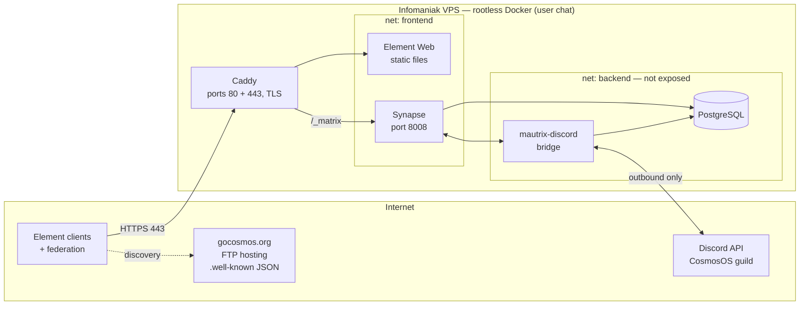

# Cosmos Community Chat Zone — Secure Hosting Plan

Self-hosted Matrix homeserver + Element web client for the Cosmos community,
bridged (mirrored) to the CosmosOS Discord server. Hardened following the
OWASP Docker Top 10, running entirely under **rootless Docker**.

## 1. Overview

| Item | Value |
|---|---|
| VPS | Infomaniak — Debian 13, 4 vCPU, 11 GB RAM, 20 GB root disk + 250 GB data disk |
| Public IPs | `<VPS_IPV4>` / `<VPS_IPV6>` |
| Matrix server name (user IDs) | `gocosmos.org` → `@user:gocosmos.org` |
| Homeserver (Synapse) | `matrix.gocosmos.org` |
| Element web | `chat.gocosmos.org` |
| `.well-known` delegation | Static JSON on the existing `gocosmos.org` FTP hosting |
| Federation | Via `.well-known` on port **443** (no 8448 needed) |

### DNS records to create

```
matrix.gocosmos.org   A     <VPS_IPV4>
matrix.gocosmos.org   AAAA  <VPS_IPV6>
chat.gocosmos.org     A     <VPS_IPV4>
chat.gocosmos.org     AAAA  <VPS_IPV6>
```

## 2. Architecture



Only Caddy publishes ports (80/443). Postgres and the bridge are reachable
solely on the internal `backend` network. The bridge makes **outbound-only**
connections to Discord.

## 3. Components

| Component | Image | Role |
|---|---|---|
| Caddy | `caddy` | Reverse proxy, automatic TLS (Let's Encrypt), security headers |
| Synapse | `matrixdotorg/synapse` | Matrix homeserver (client API + federation) |
| PostgreSQL | `postgres:17` | Database for Synapse + bridge (separate DBs/users) |
| Element Web | `vectorim/element-web` | Static web client |
| mautrix-discord | `dock.mau.dev/mautrix/discord` | Discord ⇄ Matrix mirror bridge |

All images **pinned by digest** (`image@sha256:…`), updated deliberately (see §9).

Not needed: coturn (VoIP relay) and sliding-sync proxy can be added later;
Synapse now serves Element X natively.

## 4. Host hardening (Debian 13)

- **Users** — keep `debian` (sudo, SSH admin). Create a dedicated
  **non-sudo user `chat`** that owns the rootless Docker daemon and the stack.
  `loginctl enable-linger chat` so services survive logout/reboot.
- **SSH** (`/etc/ssh/sshd_config.d/hardening.conf`):
  `PasswordAuthentication no`, `PermitRootLogin no`, `KbdInteractiveAuthentication no`,
  `AllowUsers debian chat`, `MaxAuthTries 3`.
- **Firewall** — nftables (or ufw): default deny inbound; allow `22`, `80`, `443`
  (TCP, v4+v6). Nothing else. Rootless Docker does **not** bypass the host
  firewall the way rootful Docker does — rules actually apply.
- **fail2ban** — jails for sshd and Caddy access log (Matrix login abuse).
- **unattended-upgrades** — automatic Debian security updates.
- **Swap** — 2 GB swapfile (the VPS ships with none) + `vm.swappiness=10`.
- **Time** — systemd-timesyncd (default) verified; Matrix federation is
  signature/timestamp sensitive.

## 5. Rootless Docker

Why: the Docker daemon and every container run as the unprivileged `chat`
user. A container escape lands in a no-sudo account, not root. This is the
strongest single mitigation on the list (OWASP D01).

Setup (as `chat`):

```bash
sudo apt install docker-ce docker-ce-cli containerd.io docker-compose-plugin \
                 docker-ce-rootless-extras uidmap slirp4netns
dockerd-rootless-setuptool.sh install
systemctl --user enable --now docker
```

Two gotchas that MUST be handled:

1. **Privileged ports** — rootless can't bind 80/443 by default:
   ```
   # /etc/sysctl.d/99-rootless.conf
   net.ipv4.ip_unprivileged_port_start=80
   ```
2. **Real client IPs** — the default rootless port forwarder hides source
   addresses (everything appears as 127.0.0.1), which would blind Synapse
   rate-limiting and fail2ban. Fix with the slirp4netns port driver:
   ```
   # ~/.config/systemd/user/docker.service.d/override.conf
   [Service]
   Environment="DOCKERD_ROOTLESS_ROOTLESSKIT_PORT_DRIVER=slirp4netns"
   ```

Resource limits (memory/pids) require cgroup v2 delegation — enabled by
default on Debian 13/systemd, verify with
`cat /sys/fs/cgroup/user.slice/user-$(id -u chat).slice/cgroup.controllers`.

## 6. Container hardening — OWASP Docker Top 10 mapping

| OWASP | Measure here |
|---|---|
| D01 Secure user mapping | Rootless daemon; non-root UIDs inside containers (Synapse `UID/GID` env, postgres user) |
| D02 Patch management | Digest-pinned images, weekly update routine (§9), unattended-upgrades on host |
| D03 Network segmentation | `frontend` / `backend` compose networks; DB and bridge unreachable from outside; only Caddy publishes ports |
| D04 Secure defaults & hardening | Every service: `security_opt: [no-new-privileges:true]`, `cap_drop: [ALL]`, `read_only: true` where the image allows, `tmpfs` for scratch dirs |
| D05 Security contexts | Single prod host; secrets and configs owned by `chat`, mode `600` |
| D06 Protect secrets | `.env` + secret files never committed (`.gitignore`); tokens: postgres passwords, `registration_shared_secret`, macaroon/form secrets, bridge `as_token`/`hs_token`, Discord bot token |
| D07 Resource protection | Per-service `mem_limit`, `pids_limit`, `cpus`; Synapse rate limiting (defaults kept); `max_upload_size: 20M` |
| D08 Image integrity | Official registries only, pinned by `sha256` digest, reviewed before bumping |
| D09 Immutability | Read-only root filesystems; writable state confined to named volumes (`pgdata`, `synapse-data`, `caddy-data`) |
| D10 Logging | `json-file` driver with `max-size: 10m, max-file: 3`; Caddy access logs fed to fail2ban; Synapse logs at INFO |

Example service block (pattern applied to all):

```yaml
  synapse:
    image: matrixdotorg/synapse@sha256:<digest>
    restart: unless-stopped
    security_opt: ["no-new-privileges:true"]
    cap_drop: [ALL]
    read_only: true
    tmpfs: [/tmp]
    volumes: ["synapse-data:/data"]
    networks: [frontend, backend]
    mem_limit: 4g
    pids_limit: 512
    logging:
      driver: json-file
      options: { max-size: "10m", max-file: "3" }
```

## 7. Application hardening

### Synapse (`homeserver.yaml`)

- `server_name: gocosmos.org`, `public_baseurl: https://matrix.gocosmos.org/`
- **Registration**: `enable_registration: true` + `registration_requires_token: true`
  — invite tokens generated by admins; no open signup, no CAPTCHA dependency.
- `allow_guest_access: false`
- `password_config.policy`: enabled, min length 12.
- `url_preview_enabled: false` (kills the classic SSRF vector; if ever enabled,
  `url_preview_ip_range_blacklist` must cover RFC1918 + link-local + metadata IPs).
- `max_upload_size: 20M`
- **Media retention** (20 GB disk!):
  `media_retention: { local_media_lifetime: 90d, remote_media_lifetime: 14d }`
- Rate limiting: keep Synapse defaults (they're sane) — works because real
  client IPs are preserved (§5.2).
- Federation: open (community server). Optional lockdown later via
  `federation_domain_whitelist`.
- `report_stats: false`
- **Admin API**: `/_synapse/admin` is blocked at Caddy; use via SSH tunnel only
  (`ssh -L 8008:localhost:8008` → rootless slirp note: tunnel to the published
  port on the VPS loopback).

### Caddy

```caddyfile
matrix.gocosmos.org {
    header Strict-Transport-Security "max-age=31536000; includeSubDomains"
    @admin path /_synapse/admin/*
    respond @admin 403
    reverse_proxy /_matrix/* synapse:8008
    reverse_proxy /_synapse/client/* synapse:8008
}

chat.gocosmos.org {
    header {
        Strict-Transport-Security "max-age=31536000; includeSubDomains"
        X-Content-Type-Options nosniff
        X-Frame-Options DENY
        Content-Security-Policy "frame-ancestors 'none'"
        Referrer-Policy strict-origin-when-cross-origin
    }
    reverse_proxy element:80
}
```

Element and Synapse are on **separate origins** deliberately: user-uploaded
media served by Synapse can never script against the Element session.

### Element (`config.json`)

```json
{
  "default_server_config": {
    "m.homeserver": { "base_url": "https://matrix.gocosmos.org", "server_name": "gocosmos.org" }
  },
  "disable_guests": true,
  "disable_custom_urls": true
}
```

### mautrix-discord bridge

- Create a Discord **bot application** with only the intents/permissions needed
  to read the mirrored channels and manage webhooks.
- Relay mode: Discord users appear as Matrix ghosts; Matrix users are relayed
  to Discord through webhooks (native look).
- Bridge `permissions`: only Cosmos admins may manage the bridge; everyone
  else `relay` level.
- Bridged rooms stay **unencrypted** (they mirror public Discord channels —
  encryption there would be security theater).
- `as_token` / `hs_token` / bot token stored as secret files, mode `600`.

### `.well-known` on gocosmos.org (upload via FTP)

`https://gocosmos.org/.well-known/matrix/server`:
```json
{ "m.server": "matrix.gocosmos.org:443" }
```

`https://gocosmos.org/.well-known/matrix/client`:
```json
{ "m.homeserver": { "base_url": "https://matrix.gocosmos.org" } }
```

The **client** file needs CORS + JSON content-type — `.htaccess` next to it:
```apache
<Files "client">
  Header set Access-Control-Allow-Origin "*"
  Header set Content-Type "application/json"
</Files>
```

## 8. PostgreSQL

- One instance, two databases/users: `synapse` and `mautrix_discord`,
  each with its own random password; no superuser access for apps.
- Synapse requires `C` locale:
  `POSTGRES_INITDB_ARGS: "--encoding=UTF8 --locale=C"`.
- Listens only on the `backend` network — never published.

## 9. Backups, updates, monitoring

**Backups (nightly cron, kept OFF the VPS):**
- `pg_dump` of both databases
- Synapse **signing key** + `homeserver.yaml` + bridge `registration.yaml`
  (losing the signing key breaks federation identity permanently)
- Media store (optional / size-permitting)
- Ship with `restic` (encrypted, deduplicated) to Infomaniak Swiss Backup
  (S3/Swift) or any off-box target. Test a restore once after setup.

**Updates:**
- Host: unattended-upgrades (automatic).
- Containers: weekly — review changelogs, bump image digests in git,
  `docker compose pull && docker compose up -d`. No auto-updater (Watchtower)
  — silent upgrades of a federation server are how you get surprise outages.

**Monitoring (minimum viable):**
- Disk usage alert at 80 % (cron + mail/webhook) — the 20 GB disk is the
  most likely thing to fail first.
- `docker compose ps` health checks on all services.
- Later: Synapse Prometheus metrics + Grafana if desired.

## 10. Repository layout

```
CosmosVps/
├── docs/secure-chat-zone.md      # this document
├── compose.yml
├── .env.example                  # template — real .env is never committed
├── .gitignore                    # .env, secrets/, *.key, ssh.private, ssh.public
├── caddy/Caddyfile
├── synapse/homeserver.yaml       # secrets referenced via files, not inline
├── element/config.json
├── bridge/config.yaml
└── wellknown/                    # files to upload to gocosmos.org via FTP
    ├── server
    ├── client
    └── .htaccess
```

## 11. Rollout checklist

1. [ ] Add the 4 DNS records (§1) and wait for propagation
2. [ ] Remove `ssh.private` / `ssh.public` from this folder (already installed in `~/.ssh`)
3. [ ] Host: swap, SSH hardening, nftables, fail2ban, unattended-upgrades
4. [ ] Create `chat` user, install rootless Docker + the two gotcha fixes (§5)
5. [ ] Scaffold compose stack + configs in this repo, generate secrets
6. [ ] Upload `.well-known` files + `.htaccess` to gocosmos.org via FTP
7. [ ] `docker compose up -d`; verify TLS on both domains
8. [ ] Validate federation: https://federationtester.matrix.org against `gocosmos.org`
9. [ ] Create admin account (registration token), log in via `chat.gocosmos.org`
10. [ ] Create Discord bot, configure mautrix-discord, bridge the CosmosOS guild
11. [ ] Set up restic backups + disk alert; test a restore
12. [ ] Invite the community 🎉
